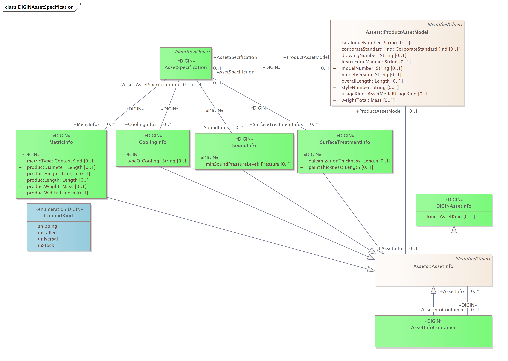
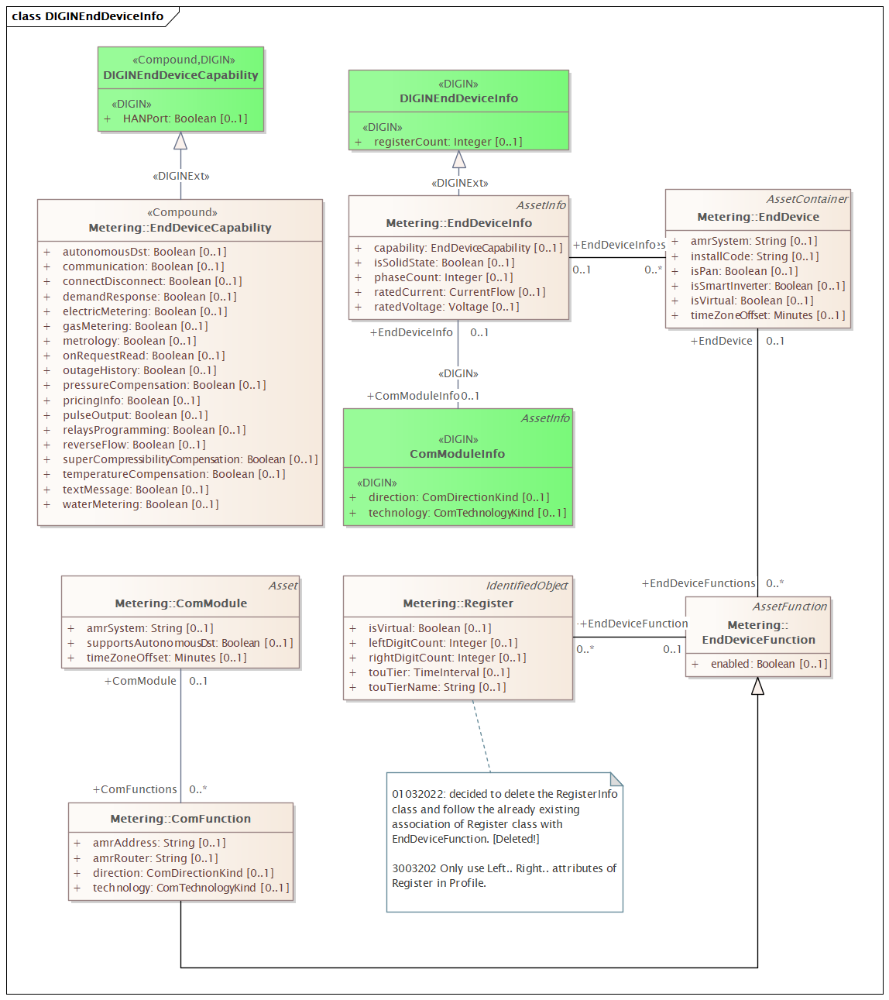
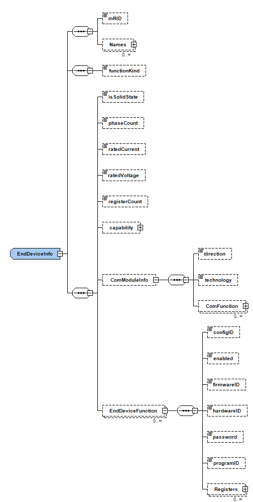

<div id="top"></div>


[![MIT License][license-shield]][license-url]
[![LinkedIn][linkedin-shield]][linkedin-url]


<!-- PROJECT LOGO -->
<br />
<div align="center">
  <a href="https://diginenergi.no/">
    
  </a>

  <h3 align="center">The DIGIN program is the Norwegian grid operators' digitalisation initiative, where Norwegian DSOs, the TSO, regulator and others have joined forces to create the fundament for full digital interaction in both planning and operation of the electrical grid. 
  </h3>


  <p align="center">
   Development work in DIGIN is organized as coordinated work packages, all supporting the overall vision of the program.
    <br />
    <a href="https://github.com/digin-energi/produktdata-public"><strong>Explore the docs »</strong></a>
    <br />
    <br />
    <a href="https://github.com/digin-energi/produktdata-public/issues">Report Bug</a>
    ·
    <a href="https://github.com/digin-energi/produktdata-public/issues">Request Feature Enhancement</a>
  </p>
</div>


<!-- TABLE OF CONTENTS -->

<details>
  <summary>Table of Contents</summary>
  <ol>
    <li>
      <a href="#about-the-project">About The Project</a>
      <ul>
        <li><a href="#usecases">Usecases</a></li>
      </ul>
    </li>
    <li>
      <a href="#iec-61968-4-scope">IEC 61968-4 Scope</a>
      <ul>
        <li><a href="#assetcatalogue-message">AssetCatalogue Message</a></li>
        <li><a href="#digin-extensions">DIGIN Extensions</a></li>
      </ul>
    </li>
    <li><a href="#roadmap">Roadmap</a></li>
    <li><a href="#tools-and-examples">Tools and Examples</a></li>
    <li><a href="#license">License</a></li>
    <li><a href="#contact">Contact</a></li>
    <li><a href="#versioning">Versioning</a></li>
  </ol>
</details>


<!-- ABOUT THE PROJECT -->
# About The Project

The 'Product data project' is a project under the DIGIN program. Deliverables from this project will enable automated exchange of data related to planning and operation of the electrical grid. The project is working with standard exchange formats for data such as: :

* Product data 
* Descriptions (requirements) of functions for grid equipment required when purchasing
* Test protocol data (FAT/SAT)
* Data about components of grid equipment (asset data)

Automated exchange of data will improve data quality and simplify current manual registration processes.

Centralized publishing of new and historic product data is another goal for the project. This will avoid establishment of redundant databases for standard data at the grid operators, contractors, and manufacturers. 

CIM, the standard for exchange of power systems related information (data), has been extended to cover the data needs of the DSOs. 

The outcome of the project is: 
* A dedicated CIM profile to be used by the DSOs and product suppliers (IEC 61968-4:2019), adapted to the Norwegian industry
* An increasing number of standard products which can exchange data according to CIM
* Standard schemas (XML) for exchange of data according to CIM 
* A validation tool, assuring data transfer and -formats are according to CIM


<p align="right">(<a href="#top">back to top</a>)</p>

<!-- USECASES -->
## Usecases

An AssetCatalogue is a collection of information regarding available types of products and materials that are used to build or install assets, to maintain assets or to operate assets.  

Each catalogue item is for a specific product available from a specific manufacturer. Herein, the AssetCatalogue usecase is further divided into two scenarios:
* AssetShipmentCatalogue - The target AssetCatalogue message within the scenario may contain reference information such as weight, dimennsions, drawingNumber and modelNumber about a specific ProductAssetModel.
* AssetSpecificationCatalogue - The target AssetCatalogue message within the scenario may contain reference information such as typeOfCooling, minSoundPressureLevel and paintThickness about a specific ProductAssetModel as well as the AssetInfo rating information for it.

The AssetCatalogue message is used to exchange asset catalogue information. Example applications include replacement of generic assets and long term planning. 
* While installing assets, a maintenance person may query the catalogue for a specific product model of interest. 
* In long term planning, a project may have a set of requirements and the organisation’s catalogue of approved product models is used as a basis of decision-making. 

An engineer or analytic queries the catalogue and applies the selection rules in order to identify catalogue items with specifications that meet the project requirements

*This section should list any usecase and their related explanation used to bootstrap the project. Leave any related usecase for the development and enhancement.*

<p align="right">(<a href="#top">back to top</a>)</p>


<!-- GETTING STARTED -->
# IEC 61968-4 Scope

This part of IEC 61968 specifies the information content of a set of message types that can be used to support many of the business functions related to records and asset management. Typical uses of the message types defined in this Part of IEC 61968 include network extension planning, copying feeder or other network data between systems, network or diagram edits and asset inspection. Message types defined in other Parts of IEC 61968 may also be relevant to these use cases.

## AssetCatalogue Message

The AssetCatalogue message contains an information of a Product modelled within ProductAssetModel CIM Class. Following are the assets which can be associated to a ProductAssetModel:

* Power Transformer
* End Device
* Circuit Breakers
* Disconnectors
* Fuses
* Cables
* Overhead Lines
* Bushing
* Earth ground wire
* Auxiliary Equipment
* Compensators
* Conductors
* Connectors
* End Devices
* Generators
* Protection Devices
* Structure Devices
* Switchgear
* Terminations
* Current Transfomers
* Voltage Transformers

## DIGIN Extensions
In this project, for the two above mentioned scenarios - ProductShipmentCatalogue and ProductRequirementCatalogue, the metamodel extensions are being developed by the DIGIN team after deep consideration on the concerns of the Distribution System Operators (DSOs) and vendors. 

The extensions developed within DIGIN Produktdata workstream have ***http://digin.no/DIGIN/CIM100Extension/1/0#*** namespace. 

<p align="right">(<a href="#top">back to top</a>)</p>

<!-- ROADMAP -->
# Roadmap

The project has a plan to undergo the enhancement of each aforementioned product asset. Following is the short term development plan of the DIGIN Team and achievements:

## General Extensions

- [x] AssetSpecification has general extensions related to specification or requirements the product such as electrical, dimensional, protective and audiable parameters. Follow are the UML diagram and detailed XML schema. 


<ol><details><ul>

### **UML Class Diagram**
<p align="center"></p>

### **AssetSpecificaition**
A specification or requirements of a product in terms of dimentions or techncial or any other.

### **AssetInfoContainer**
A containment of asset info. It contains the datasheet or nameplate information of assets which are shipped within a single product.

### **ContextKind**
Enumeration «enumeration» in package 'DIGINAssetSpecification'
* ATTRIBUTES
  * shipping :   Public
  * installed :   Public
  * universal :   Public
  * inStock :   Public

### **CoolingInfo**
Description of the assets cooling method or principles.
* ATTRIBUTES
  * typeOfCooling : String  Public
Type of transformer cooling class (four letter code ONAN, ONAF etc.) or any other cooling type or system used on the asset. 
 	
### **DIGINAssetInfo**
Extension to AssetInfo
* ATTRIBUTES
  * functionKind : FunctionKind  Public,
Specific information of what kind of function the AssetInfo data refers to or are supposed to fulfill. 
 	
### **FunctionKind**
Specific information of what kind of function the AssetInfo data refers to or are supposed to fulfill. 
* ATTRIBUTES
  * breaker :   Circuit breaker function.
  * currrentTransformer :  Current transformer function.
  * disconnectingCircuitBreaker :   Disconnecting cricuit breaker function.
  * disconnectingLoadBreaker :  Disconnecting load breaker function.
  * disconnector :   Disconnector function.
  * faultIndicator :   Fault indicator function.
  * fuse :   Fuse function.
  * groundDisconnector :   Ground disconnector function.
  * jumper :   Jumper function.
  * loadBreakSwitch :   Load break switch function.
  * petersenCoil :   Petersen coil function.
  * potentialTransformer :   Potential transformer function.
  * powerTransformer :   Power transformer function.
  * seriesCompensator :   Series compensator function.
  * shuntCompensator :   Shunt compensator function.
  * surgeArrester :  Surge arrester function.
  * tapChanger :  Tapchanger function.
  * thermometer :  Thermometer function.
  * waveTrap :  Wave trap function.
 	
### **MetricInfo**
Dimensions and weight of an asset. 
* ATTRIBUTES
  *  metricType : ContextKind  Public,
The kind of context dimension and weight applies to. 
  * productDiameter : Length  Public,
  * productHieght : Length  Public,
  * productLength : Length  Public,
  * productWeight : Mass  Public,
  * productWidth : Length  Public,
 	
### **SoundInfo**
Information about protective measures against corrosion used on the asset surface 
*ATTRIBUTES
  * minSoundPressureLevel : Pressure  Public, Lowest possible sound pressure level in dB(A) according to IEC 60076-10 
 	
### **SurfaceTreatmentInfo**
Information about sound emission from the asset during normal operation.
* ATTRIBUTES
  * galvanizationThickness : Length  Public, Thickness of galvanization on the asset surface.
  * paintThickness : Length  Public, Thickness of paint on the asset surface.

</ul></details></ol>


## Product Extensions

The DIGIN teams has made a following prioritisation of the development product extentions. The details of the extention in terms of UML diagrams and XML schema are also presented.

Tags related to development 

`completed` means the extension task has finalised by the development team and open for discussion and further enhancement, 

`planned` means the given product is next target development, and

`inprogress` means the given product is in ehnacement phase 

`no extension require` mean there is no foreseen extension associated to the given product 

<!-- Power Transfomer -->
### **PowerTransformer** 
> PowerTransformer (`completed`) 
<ol><ul><details><summary>details</summary><ul>

### **UML Class Diagram**
<p align="center"></p>

### **Profile Diagram**
<p align="center"></p>

### **DIGINTransformerTankInfo**
Extension of TransformerTankInfo
* ATTRIBUTES
* insolutionType : TransformerTankInsulationKind  Public, Kind of insulation used in the transformer tank.
 
### **TransformerTankInsulationKind**
Enumeration «DIGIN» in package 'DIGINTransformer'
* ATTRIBUTES
  * dry-type :   Public
  * gas-filled :   Public
  * liquid-immersed :   Public

</ul></details></ol>


<!-- End Devices -->
### **End Devices**
> EndDevice (`completed`) 
<ol><ul><details><summary>details</summary><ul>

### **UML Class Diagram**
<p align="center"></p>

### **Profile Diagram**
<p align="center"></p>

### **ComModuleInfo**
Communication module data sheet information.
* ATTRIBUTES
  * direction : ComDirectionKind  Public
  * technology : ComTechnologyKind  Public

### **DIGINEndDeviceCapability**
Extension to EndDeviceCapability
* ATTRIBUTES
  * HANPort : Boolean  Public, True if HAN port is available.

### **DIGINEndDeviceInfo**
Extension to EndDeviceInfo
* ATTRIBUTES
  * registerCount : Integer  Public, The number of registers associated with an end device.

</ul></details></ul></ol>

<!-- Lines -->
### **Lines**
> Cables (`completed`) 
<ol><ul><details><summary>details</summary><ul>

### **UML Class Diagram**
<p align="center"></p>
	

### **Profile Diagram**


### **MulticoreCableShieldKind**
Enumeration Class
* ATTRIBUTES
  * combined :   Public
  * stranded :   Public
  * tape :   Public

### **MulticoreCableConstructionKind**
Enumeration Class
* ATTRIBUTES
  * concentric :   Public
  * triangle :   Public

### **MulticoreCableInfo**
The information of the common outer layer of the multicore cable
* ATTRIBUTES
  * armourMaterialType : CableArmourMaterialKind  Public, material of the armour
  * multicoreConstructionKind : multicoreCableConstructionKind  Public
  * innerRadiusFromCentre : Length  Public
  * phaseReactance50 : ReactancePerLength  Public, Reactance per length at 50Hz.
  * shieldKind : MulticoreCableShieldKind  Public, a kind of shielding. 
   thicknessArmour : Length  Public, The thickness of the armour.
  * thicknessInnerJacket : Length  Public, Thickness of the inner jacket. If it doesnot exist, then value shall be 0.
  * thicknessInnerScreen : Length  Public, Thickness of semi-conducting layer (generally referred to as screen).
  * thicknessOuterJacket : Length  Public, Thickness of the outer jacket. If it doesnot exist, then value shall be 0.
  * thicknessShield : Length  Public, The thickness of the shield

### **CableArmourMaterialKind**
Enumeration Class
* ATTRIBUTES
  * galvanizedSteel :   Public

### **DIGINCableInfo**
Extension of CableInfo
* ATTRIBUTES
  * nominalCapacitance : CapacitancePerLength  Public,Nominal capacitance per length of the cable.
  * ratedShortCircuitCurrent : CurrentFlow  Public, One second rated short circuit current. 
  * ratedVoltage : Voltage  Public, Rated Voltage

### **DIGINConcentricNeutralCableInfo**
Extension of  ConcentricNeutralCableInfo 
* ATTRIBUTES
  * neutralStrandXAC50 : ReactancePerLength  Public, Concentric neutral reactance at 50hz. It is an AC component.

### **DIGINWireInfo**
* ATTRIBUTES
  * totalWeigthPerLength : Length  Public, Total weight per length of a wire.
  * typeDesignation : String  Public, A string that defines the code of the wire as per the standard EN50182 ( for bare wires) or CENELEC HD 361 S4 (for cables) or any other regional or local standard.

### **BundledCableInfo**
Information of bundled cable.

### **OpticalFibreCableInfo**
An optical fibre cable.

</ul></details></ul></ol>

> Conductors
  
> OverheadLines (`no extension required`)

> EarthGroundWire

<!-- Switchgear -->
### **Switchgear**	

> Disconnector

> GroundDisconnector

> Jumper

> Clamp

> Fuse

> Breaker

> Recloser

> LoadBreakSwitch

> InterrupterUnit

> OperatingMechanism

> CircuitBreakers

> Disconnectors

<!-- Auxiliary Equipment -->
### **Auxiliary Equipment**	

> CurrentTransformer

> PostLineSensor

> PotentialTransformer

> WaveTrap

> SurgeArrester

> FaultIndicator

> AirCompressor

<!-- Structure Devices -->
### **Structure Devices**	

> PrefabricatedBuilding

> CableCabinet

> Pole

> Crossarm

> Insulator

<!-- Connectors -->
### **Connectors**	

> Connector

> Termination

> Joint

> Bushing (`no extension required`)

<!-- Compensator -->
### **Compensators**	

> SeriesCompensator

> ShuntCompensator

> PetersenCoil

<!-- Protection Equipment -->
### **Protection Equipment**

> ProtectionEquipment

<!-- Generators -->
### **Generators**

> Generators

See the [open issues](https://github.com/digin-energi/produktdata-public/issues) for a full list of proposed features (and known issues).

<p align="right">(<a href="#top">back to top</a>)</p>


<!-- CONTRIBUTION -->
## Tools and Examples

### Tools
#### XSD Diagram
* XSD Diagram is a free Xml Schema Definition (XSD) diagram viewer for Windows written in C# Framework.NET 2.0.

* This program is free software and may be distributed according to the terms * of the GNU General Public License (GPL).

* The latest source code is available at github.com/dgis/xsddiagram

* For download and use, follow the instruction at http://regis.cosnier.free.fr/?page=XSDDiagram

#### CIMTool
* CIMTool is an open source tool that supports the Common Information Model (CIM) standards used in the electric power industry. It is potentially useful for other semantic applications too. CIMTool can be downloaded in several forms from the https://wiki.cimtool.org/Download.html 

#### CimConteXtor
* This product is an opensource product governed by a group of  companies under the leadership of ENTSO-E.

* You can get the source code on request  under the GPL license CeCill-B  ( manuals), however, you can download the addins from https://www.cimcontextor.net/

* CimConteXtor is an add-in to “Sparx Systems Enterprise Architect” (EA) product which exists since 2010.

* It extends EA functionalities by providing a framework that allows creation and management of UML profiles "based on" existing UML models, and helps you to do these profiles according to a rigorous methodology that is explained in the Annex of CimConteXtor user manual.

#### DIGIN Energi Validation Tool
* As a part of the DIGIN Energi, DNV has developed a XML validator for validating a XML file against a XSD file. The validation results a written in a text file which can be opened and viewed by any text editor (e.g. notepad).
* The validation can be done in 2 ways, with or without self-provided xml schema.
* The tool is open source and can be downloaded from https://github.com/digin-energi/Produktdata/blob/main/validationtool/XmlXsdValidator.exe 

### Examples

<details><summary>Example of DSO Transformer Specification</summary><p>

```xml
<?xml version="1.0" encoding="UTF-8"?>
<m:AssetCatalogue xmlns:m="http://digin.no/DIGIN/CIM100Extenstion/1/0#" 
xmlns:xsi="http://www.w3.org/2001/XMLSchema-instance" 
xsi:schemaLocation="http://digin.no/DIGIN/CIM100Extenstion/1/0# ../Schema/DIGINProfile_iec61968_part4_TransformerProductData_v026.xsd ">
	<m:ProductAssetModel>
		<m:mRID>fd5f73f3-622a-4e7d-ac37-b07a642b14e6</m:mRID>
		<m:Names>
			<m:name>22_415_500 Model</m:name>
		</m:Names>
		<m:AssetSpecification>
			<m:CoolingInfo>
				<m:typeOfCooling>ONAN</m:typeOfCooling>
			</m:CoolingInfo>
			<m:SoundInfo>
				<m:minSoundPressureLevel unit="dB">60</m:minSoundPressureLevel>
			</m:SoundInfo></m:AssetSpecification>
		<m:AssetInfoContainer>
			<m:PowerTransformerInfo>
				<m:kind>transformer</m:kind>
				<m:TransformerTankInfos>
					<m:insulationKind>liquid-immersed</m:insulationKind>
					<m:TransformerEndInfos>
						<m:connectionKind>D</m:connectionKind>
						<m:endNumber>1</m:endNumber>
						<m:ratedS unit="VA" multiplier="k">500</m:ratedS>
						<m:ratedU unit="V" multiplier="k">22</m:ratedU>
						<m:EnergisedEndNoLoadTests>
							<m:loss unit="W">500</m:loss></m:EnergisedEndNoLoadTests>
						<m:EnergisedEndShortCircuitTests>
							<m:power unit="VA">4000</m:power>
							<m:voltage>4</m:voltage></m:EnergisedEndShortCircuitTests></m:TransformerEndInfos>
					<m:TransformerEndInfos>
						<m:connectionKind>Yn</m:connectionKind>
						<m:endNumber>2</m:endNumber>
						<m:phaseAngleClock>11</m:phaseAngleClock>
						<m:ratedS unit="VA" multiplier="k">500</m:ratedS>
						<m:ratedU unit="V">415</m:ratedU></m:TransformerEndInfos>
				</m:TransformerTankInfos>
			</m:PowerTransformerInfo>
			<m:TapChangerInfo>
				<m:kind>other</m:kind>
				<m:highStep>7</m:highStep>
				<m:lowStep>4</m:lowStep>
				<m:neutralStep>0</m:neutralStep>
				<m:stepVoltageIncrement>2.5</m:stepVoltageIncrement>
			</m:TapChangerInfo></m:AssetInfoContainer></m:ProductAssetModel></m:AssetCatalogue>
```
</p></details>

<details><summary>Example of Manufacturer Transformer Shipment</summary><p>

```xml
<?xml version="1.0" encoding="UTF-8"?>
<m:AssetCatalogue xmlns:m="http://digin.no/DIGIN/CIM100Extenstion/1/0#" xmlns:xsi="http://www.w3.org/2001/XMLSchema-instance" xsi:schemaLocation="http://digin.no/DIGIN/CIM100Extenstion/1/0# ../Schema/DIGINProfile_iec61968_part4_TransformerProductData_v026.xsd ">
	<m:ProductAssetModel>
		<m:mRID>14c5e1f9-7fd5-4a16-a3f5-99aa84bf63dc</m:mRID>
		<m:Names>
			<m:name>Distribution Transformer 0123</m:name>
		</m:Names>
		<m:modelNumber>0123_456</m:modelNumber>
		<m:Asset>
			<m:mRID>f67a819a-b118-4a6b-aa79-08d56645ab73</m:mRID>
			<m:serialNumber>T20210006</m:serialNumber>
			<m:Medium>
				<m:mRID>0a833542-2eb4-415d-a340-055dd75d7b63</m:mRID>
				<m:Names>
					<m:name>TransformerOil Type 4</m:name>
				</m:Names>
				<m:kind>mineralOil</m:kind>
				<m:volumeSpec unit="m3">370</m:volumeSpec></m:Medium></m:Asset>
		<m:AssetSpecification>
			<m:CoolingInfo>
				<m:mRID>58a69819-7538-4b2b-b655-f502012ebde2</m:mRID>
				<m:Names>
					<m:name>Cooling Option 2</m:name>
				</m:Names>
				<m:typeOfCooling>ONAN</m:typeOfCooling>
			</m:CoolingInfo>
			<m:MetricInfo>
				<m:mRID>2bdf3764-7d59-4404-9a53-8080617ffc51</m:mRID>
				<m:Names>
					<m:name>Metrics Transformer</m:name>
				</m:Names>
				<m:metricKind>Universal</m:metricKind>
				<m:productHeight unit="m" multiplier="m">1522</m:productHeight>
				<m:productLength unit="m" multiplier="m">1167</m:productLength>
				<m:productWeight unit="kg">1832</m:productWeight>
				<m:productWidth unit="m" multiplier="m">855</m:productWidth>
			</m:MetricInfo>
			<m:SoundInfo>
				<m:minSoundPressureLevel unit="dB">58</m:minSoundPressureLevel>
			</m:SoundInfo>
			<m:SurfaceTreatmentInfo>
				<m:galvanisationThickness unit="m" multiplier="micro">40</m:galvanisationThickness>
				<m:paintThickness unit="m" multiplier="micro">80</m:paintThickness>
			</m:SurfaceTreatmentInfo></m:AssetSpecification>
		<m:Manufacturer>
			<m:Organisation>
				<m:mRID>51889225-0507-42bb-8f1f-541aaee41024</m:mRID>
				<m:Names>
					<m:name>Manufacturer X inc</m:name>
				</m:Names></m:Organisation></m:Manufacturer>
		<m:AssetInfoContainer>
			<m:PowerTransformerInfo>
				<m:mRID>8b094f3b-8cbc-45e7-84d1-4409ae7164ea</m:mRID>
				<m:kind>transformer</m:kind>
				<m:TransformerTankInfos>
					<m:insulationKind>liquid-immersed</m:insulationKind>
					<m:TransformerEndInfos>
						<m:connectionKind>D</m:connectionKind>
						<m:endNumber>1</m:endNumber>
						<m:ratedS unit="VA" multiplier="k">500</m:ratedS>
						<m:ratedU unit="V" multiplier="k">22</m:ratedU>
						<m:EnergisedEndNoLoadTests>
							<m:mRID>222e67a7-6174-42d8-b5ba-fe0ab878efc8</m:mRID>
							<m:Names>
								<m:name>No Load Test 001</m:name>
							</m:Names>
							<m:energisedEndVoltage unit="V" multiplier="k">22</m:energisedEndVoltage>
							<m:loss unit="W">532</m:loss></m:EnergisedEndNoLoadTests>
						<m:EnergisedEndOpenCircuitTests>
							<m:mRID>75a1d8d6-dd4c-4b00-b7fc-6af4dc214feb</m:mRID>
							<m:Names>
								<m:name>Open Circuit Test 001</m:name>
							</m:Names>
							<m:energisedEndStep>5</m:energisedEndStep>
							<m:energisedEndVoltage unit="V" multiplier="k">22</m:energisedEndVoltage></m:EnergisedEndOpenCircuitTests>
						<m:EnergisedEndShortCircuitTests>
							<m:mRID>4e2acbbd-9b68-4768-882d-28f6d1276b3f</m:mRID>
							<m:Names>
								<m:name>Short Circuit Test 001</m:name>
							</m:Names>
							<m:power unit="VA">3978</m:power>
							<m:voltage>4.1</m:voltage></m:EnergisedEndShortCircuitTests></m:TransformerEndInfos>
					<m:TransformerEndInfos>
						<m:connectionKind>Yn</m:connectionKind>
						<m:endNumber>2</m:endNumber>
						<m:phaseAngleClock>11</m:phaseAngleClock>
						<m:ratedS unit="VA" multiplier="k">500</m:ratedS>
						<m:ratedU unit="V">415</m:ratedU>
						<m:GroundedEndShortCircuitTests>
							<m:mRID>4e2acbbd-9b68-4768-882d-28f6d1276b3f</m:mRID>
							<m:Names>
								<m:name>Short Circuit Test 001</m:name>
							</m:Names></m:GroundedEndShortCircuitTests>
						<m:OpenEndOpenCircuitTests>
							<m:mRID>75a1d8d6-dd4c-4b00-b7fc-6af4dc214feb</m:mRID>
							<m:Names>
								<m:name>Open Circuit Test 001</m:name>
							</m:Names>
							<m:openEndVoltage unit="V">415</m:openEndVoltage>
							<m:phaseShift unit="deg">30</m:phaseShift></m:OpenEndOpenCircuitTests></m:TransformerEndInfos>
				</m:TransformerTankInfos>
			</m:PowerTransformerInfo>
			<m:TapChangerInfo>
				<m:mRID>48f97f2c-a79e-4fd4-bf18-2cbf0ad873b8</m:mRID>
				<m:Names>
					<m:name>Tap Changer model 987</m:name>
				</m:Names>
				<m:kind>other</m:kind>
				<m:highStep>2</m:highStep>
				<m:lowStep>4</m:lowStep>
				<m:neutralStep>0</m:neutralStep>
				<m:stepVoltageIncrement>2.5</m:stepVoltageIncrement>
			</m:TapChangerInfo></m:AssetInfoContainer></m:ProductAssetModel></m:AssetCatalogue>
```
</p></details>

<br />


<!-- LICENSE -->
## License

Copyright (c) 2019 - 2021 DIGIN Energi, All Rights Reserved.

This program is free software and may be distributed according to the terms of the MIT License.

<p align="right">(<a href="#top">back to top</a>)</p>


<!-- CONTACT -->
## Contact

Prosjektleder: Stefan Kunz, Elvia

Email: stefan.kunz@elvia.no

DIGIN Project Link: [https://diginenergi.no/hva-gjor-vi/produktdata/](https://diginenergi.no/hva-gjor-vi/produktdata/)

GitHub Project Link: [https://github.com/digin-energi/Produktdata](https://https://github.com/digin-energi/Produktdata)


<br />


<!-- Verions -->
## Versioning

Following versions are available from DIGIN Produktdata

| Version | Type | Description  | 
|---|---|---|
| 041 | `beta` |  assetKind Enumeration in *AssetInfo* is changed to functionKind and an association is created by *AssetInfo* and *Asset* class.| 
| 040 | `beta` |  MulticoreCableInfo, OpticalFibreCableInfo and BundledCableInfo with its respective enumerations and attributes are extended.| 
| 030 | `beta` |  EndDevice extension is added. ComModuleInfo a new class added| 
| 027 | `beta` |  Multiplicity of MetricInfo are changed as pec IEC WG recommendation. minSoundPressureLEvel type is changed to Pressure because we are allowed to changed the initial value and multiplier and symbol. NEK attributes extensions are added to CableInfo, WireInfo, ShuntCompensator, OverheadWireInfo and SwitchInfo. Attribute LifecycleDate in Asset is added. TransformerTest attributes (basePower and temperature) are added.| 
| 026 | `beta` |  Some attributes are added to Asset class and it is generalized to NEKAsset class to incorporate other relevent attributes. | 
| 025 | `dev` |  AssetinfoContainer, AssetSpecification and related extension classes e.g. MetricInfo and power transformer product related classes were extended | 

The versioning of the file within Produktdata follow a scheme, that is:

DIGINProfile _ iec`CIMPackage` _ part`part#` _ `ProfileName/ProfileExtensionIdentifier` _ `cimversion` _ v`ABC` . `format`

### For example

DIGINProfile_iec61968_part4_AssetCatalogue_cim100_v001.xml
| Item | Description |
| --- | --- |
| `CIMPackage` | Corresponding CIM Package i.e., 61968 in the example
| `part#`| Corresponding part of the package which defines the profile which is under extension. Otherwise, if the developed profile is absolute new extension by DIGIN then the part of the package need to identified to which it can be closely related.
| `ProfileName/ ProfileExtensionIdentifier` | Name of the existing profile or newly created profile or a profile which only focus to specific extension within the profile identified as a scenario within a defined usecase.
| `cimversion` | The version of cim IEC TC57 metamodel, currently used verion is cim100
| `ABC` | Version number in three-digit format, e.g., v001 means version of the developement in produktdata # 0.0.1

Following rules shall be used to change the versioning numbers `ABC` :

| A | B | C |
| --- | --- | --- |
| Verified and approved version for the given profile or usecase scenario ition for target extension | Changes in Class, Enumeration class, Diagrams, and Package | Changes in Attribute, Enumeration literal, Association, and Association end |


<p align="right">(<a href="#top">back to top</a>)</p>


<!-- MARKDOWN LINKS & IMAGES -->
<!-- https://www.markdownguide.org/basic-syntax/#reference-style-links -->
[license-shield]: https://img.shields.io/badge/LICENSE-MIT-green
[license-url]: /License
[linkedin-shield]: https://img.shields.io/badge/-LinkedIn-black.svg?style=flat&logo=linkedin&colorB=555
[linkedin-url]: https://www.linkedin.com/company/digin-energi/
[product-screenshot]: images/screenshot.png


